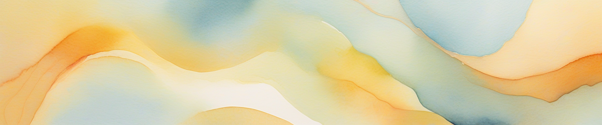
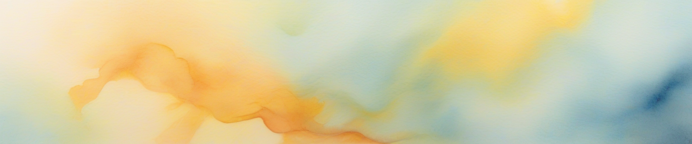
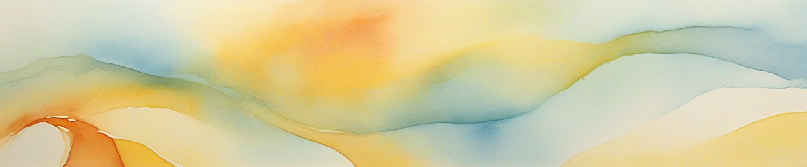
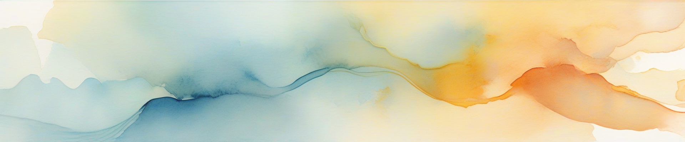
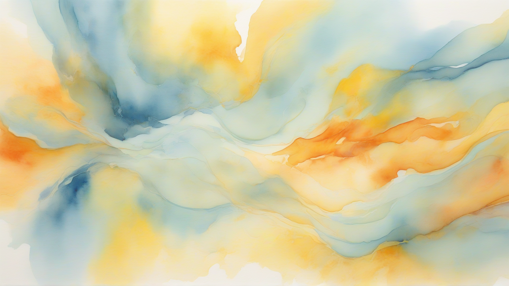
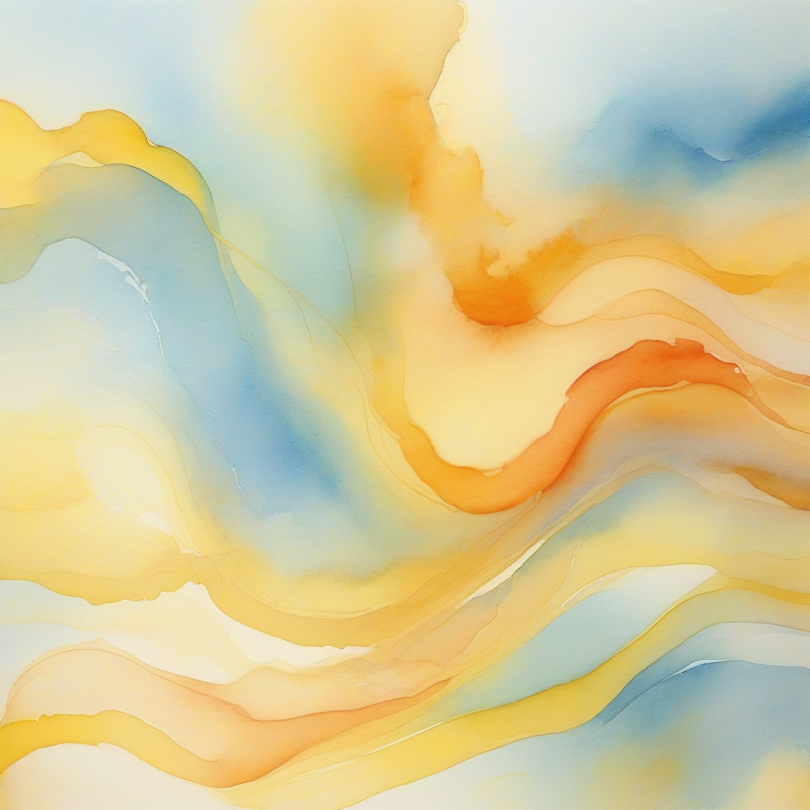

# Aipic



相关链接：**[博文](https://teahush.link/编程/Aipic图片生成项目)** | [一键部署](https://deploy.workers.cloudflare.com/?url=https://github.com/2010HCY/Aipic) | [GitHub页面](https://github.com/2010HCY/Aipic)

此项目使用Cloudflare免费提供的AI模型生成图片，使用CloudflareWorkers搭建。

有多个模型切换功能，支持以下模型：

```
dreamshaper-8-lcm (优化的照片级真实感模型)
stable-diffusion-xl-base-1.0 (高质量通用模型)
stable-diffusion-xl-lightning (快速生成模型)
flux-1-schnell (Black Forest Labs 12B参数模型)
```

可以设置生成的图像大小（flux-1-schnell不行，flux-1-schnell默认生成400×400的）

Cloudflare还提供以下模型

```
stable-diffusion-v1-5-img2img (图像到图像转换模型)
stable-diffusion-v1-5-inpainting (图像修复模型)
```

不过需要一张参考图片，我暂时没搞懂~~坐等PR~~

以下是页面预览，页面还是我特有的风格，十分好看：


## 关于参数

宽高参数都知道吧？设置图片尺寸的。

提示词知道怎么用吧？提示词是必填的 ~~难不成还要AI调用至高科技扫描你的意念生成图片？~~ 需要用英文描述，提示词最好是用详细的描述，比如：”这幅<抽象？科技？写实？>的数字<图片形式，比如油画？水墨画？>以<颜色1>、<颜色2>和<颜色3>为基调，描述了<XXX物体>“这样的方式写，最好的详细描述风格，毕竟这个模型不是GPT，过于笼统抽象的语言描述效果很烂的

负面提示词就是避免出现的内容啦，比如”过于模糊、有实物、没有明确的主角”之类的 

指令遵循度 (值范围-15~30)也就是guidance，这个值默认的7.5就好了，调高的话模型会更加遵循你的描述，但过于严格遵循指令的话会少了一些灵活性，使得画面看着很诡异，调低到0的话就是完全不遵循指令，瞎生成，1~-15值范围的效果都差不多的，建议是把值设为4~8之间

## 关于AI模型

stable-diffusion-xl-base-1.0是我个人感觉质量最高的一个，但很容易出黑图，速度还可以，就是把分辨率拉满2048×2048的话会超时（免费版Workers单次Http请求最多30秒）

另外分辨率也不建议拉的过低，过低的话会出现乱七八糟无法描述的东西~~（祂们看着你）~~，建议拉到400以上。

消耗方面不高，我今天测试跑了差不多几十张图，也就消耗了1.56k神经元（每天免费10K）

dreamshaper-8-lcm模型说是优化的照片级真实感，但其实也没有多真实，感觉一般般有点类卡通。

目前支持的四种模型中文支持都很烂，所以提示词要使用英文。（未来此项目可能会接入Cloudflare提供的文字生成AI翻译提示词为英文，希望不要咕咕咕了）


如果喜欢我~~优秀制作高雅的品味~~的项目，就给我点个Star或去我的[**博文**](https://teahush.link/编程/Aipic图片生成项目)给我点个赞吧。最后再分享点stable-diffusion-xl-base-1.0生成的美图吧。











## 更新日志

**v1.1.0 (2025.5.30)**

添加了负面提示词、质量遵循度参数支持，AI翻译提示词功能仍遥遥无期

**v1.0.0 (2025.5.29)**

Aipic横空出世，有基础的提示词、尺寸、模型选项